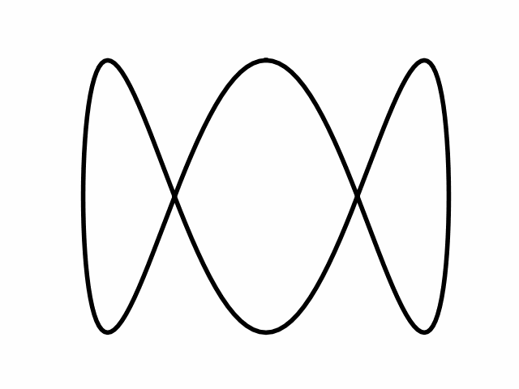

# python-2d-3d
> Matplotlib.

[Matplotlib](https://matplotlib.org) is a library providing extensive functionality for producing business graphics, as well as the flexibility to produce custom graphics with a varied appearance including animations.

This set of programs provides an introduction to the functionality.




# Reference
* [Matplotlib documentation](https://matplotlib.org/stable/index.html).


# Animation Image Optimisation

The GIF animation images created in the example are relatively large.  The following command using the [ImageMagick](https://imagemagick.org) command `convert` can be used to reduce the file size:

```bash
convert 08_koch_snowflake.gif -layers Optimize 08_koch_snowflake_small.gif
```
