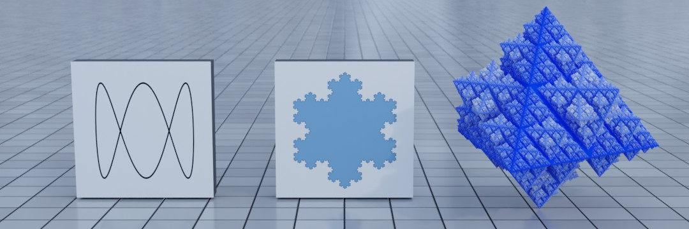

# python-2d-3d
> Python Graphics: 2D, 3D, Animation and Fractals.



This repository contains examples for:
* [Turtle Graphics](./01-turtle/README.md).
* [Matplotlib](./02-matplotlib/README.md) including animation.
* [Scalable Vector Graphics](./01-turtle/README.md) (SVG) with an example of the [Koch Snowflake](https://en.wikipedia.org/wiki/Koch_snowflake).
* A Python extension for [Inkscape](./04-inkscape/README.md).
* A Python extension for [Blender 3D](./05-blender/README.md).


# Prerequisites

* Install Python 3.x using either [MiniConda](https://docs.conda.io/en/latest/miniconda.html) or [Anaconda](https://docs.continuum.io/anaconda/install/).


# Setup

The following commands create and activate the `py-2d-3d` [conda environment](https://conda.io/projects/conda/en/latest/user-guide/tasks/manage-environments.html#creating-an-environment-from-an-environment-yml-file).

```bash
conda env create -f environment.yml

conda activate py-2d-3d
```
